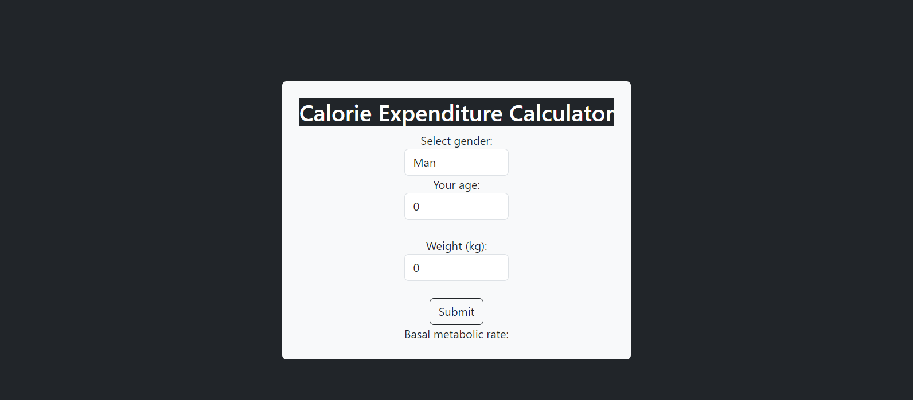

 

##  Getting Started

This project was created to calculate a person's basal metabolic rate, disregarding the physical activity factor.

|   |    Specs   |
| - | ---------- |
| :atom_symbol: | React 18.2.0 |
| :blue_square: | TypeScript |

## :cd: Download and Installation

1. Node >= 20.11.0
   - Download: https://nodejs.org/en/download/current
       - Installation: https://learn.microsoft.com/pt-br/windows/dev-environment/javascript/nodejs-on-windows 

## 📽️ Initialization

#### Run the commands

npm start

access http://localhost:5173/

## :arrow_down: Credits

Alan Oliveira
